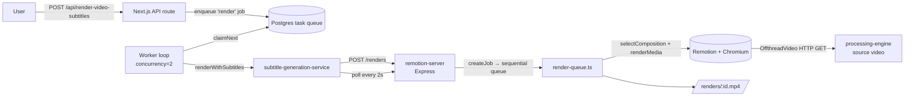

# Remotion Rendering Performance Investigation

> Issue: [#6 — Investigate video rendering performance improvements with Remotion](https://github.com/el-frontend/video-wizard/issues/6)
> Date: 2026-07-23 · Remotion `4.0.405`

## TL;DR

The render pipeline leaves almost all of Remotion's performance levers at their
defaults and serializes work in two places. The single highest-impact change is
**passing render options to `renderMedia()`** — measured on the real
composition, `x264Preset: 'veryfast'` + `offthreadVideoCacheSizeInBytes` cut
render time **~21–27%** with a one-line change, no architecture work. These
options live entirely in `apps/remotion-server/server/render-queue.ts`. A
benchmark harness (below) measures each lever in isolation.

Two counter-intuitive, empirically confirmed findings that shape the plan:
**forcing `concurrency` higher did not help and sometimes _hurt_** (the workload
is encode-bound and Remotion's default already uses ~half the cores), and
**`chromiumOptions.gl: 'swangle'` was 2× slower on macOS** — so `gl` must never
be hard-coded without benchmarking on the production OS. The real throughput win
is _cross-render_ parallelism, not per-render concurrency.

Headline findings:

1. **`renderMedia()` runs with defaults** — no `concurrency`, `x264Preset`,
   `offthreadVideoCacheSizeInBytes`, or `chromiumOptions`. See
   `render-queue.ts:96`.
2. **Two-layer serialization** — the worker dispatches up to `concurrency=2`
   render jobs, but the Remotion server's queue processes renders **strictly
   sequentially** (`render-queue.ts:150`, `queue = queue.then(...)`), and each
   single render only uses Remotion's default concurrency (~half the cores).
   Cores sit idle.
3. **`remotion.config.ts` is dead on the render path** — `Config.*` from
   `@remotion/cli/config` only affects the Remotion **CLI**, not the
   `@remotion/renderer` Node API used by the server. So `jpeg` and the `angle`
   OpenGL renderer set there are **not applied** to production renders.
4. **A prior hardening fix regressed** — `shm_size: 2gb` + `RENDER_CONCURRENCY`
   (added in a previous session to stop Chromium exhausting Docker's 64 MB
   `/dev/shm`) are **no longer present** in the root `docker-compose.yml` after
   the queue refactor.
5. **The container renders in dev mode** — the root compose overrides the image
   `CMD` with `pnpm dev` (`tsx watch`) and sets `NODE_ENV=development`.
6. **The bundle is rebuilt on every boot** — `REMOTION_SERVE_URL` is empty, so
   `bundle()` runs at startup with no persisted/cached artifact.

---

## 1. Current architecture



Key files:

| Concern                            | File                                                                   | Note                                                     |
| ---------------------------------- | ---------------------------------------------------------------------- | -------------------------------------------------------- |
| Render engine call                 | `apps/remotion-server/server/render-queue.ts`                          | `renderMedia()` at line 96; sequential queue at line 150 |
| Server boot / bundle               | `apps/remotion-server/server/index.ts`                                 | `bundle()` at 162, `ensureBrowser()` at 152              |
| CLI-only config (unused by server) | `apps/remotion-server/remotion.config.ts`                              | jpeg + `angle` GL — not applied to Node API              |
| Composition                        | `packages/remotion-compositions/src/compositions/VideoComposition.tsx` | `OffthreadVideo` + caption overlay                       |
| Web → server bridge                | `apps/web/server/services/subtitle-generation-service.ts`              | POST + 2s poll (line 171, 217)                           |
| Worker                             | `apps/web/server/worker/loop.ts`                                       | `concurrency=2` (default), `WORKER_CONCURRENCY`          |
| Container                          | `apps/remotion-server/Dockerfile`, root `docker-compose.yml`           | dev-mode command, no `shm_size`, no limits               |

---

## 2. How rendering is configured today

The entire per-render configuration is this call (`render-queue.ts:96`):

```ts
await renderMedia({
  cancelSignal,
  serveUrl,
  composition,
  inputProps,
  codec: 'h264',
  onProgress: (progress) => {
    /* logs + updates job state */
  },
  outputLocation: path.join(rendersDir, `${jobId}.mp4`),
});
```

Everything else is a Remotion default:

- **`concurrency`**: unset → Remotion picks ~half the logical cores. On a
  12-core host a single render uses ~6 workers; the other ~6 are idle, and no
  second render runs because the server queue is sequential.
- **`x264Preset`**: unset → `medium`. Faster presets trade a little file size
  for markedly faster encoding.
- **`offthreadVideoCacheSizeInBytes`**: unset → default cache. Larger cache
  reduces repeated frame extraction from the source video.
- **`chromiumOptions.gl`**: unset → platform default. `remotion.config.ts` sets
  `angle`, but that only applies to the CLI, not this Node API path.
- **`jpegQuality` / `imageFormat`**: unset. `renderMedia` defaults to `jpeg`,
  which happens to match the (dead) config, so this one is coincidentally fine.

---

## 3. Benchmark methodology

Harness: `apps/remotion-server/bench.mjs` (self-contained, committed with this
investigation). It:

1. Bundles the **real** `VideoWithSubtitles` composition once (measures
   cold-start bundle time).
2. Serves the sample video over HTTP — mirroring production, where
   `OffthreadVideo` fetches the source from the processing-engine over HTTP.
3. Calls `selectComposition` once (measures per-job selection cost) and reuses
   the result so only `renderMedia()` is timed.
4. Runs a discarded **warmup** render, then times each config, then re-runs the
   baseline to measure drift/variance.
5. Isolates one variable per config (baseline exactly mirrors `render-queue.ts`).

Fixed workload: **1080×1920, 300 frames @ 30 fps (10 s), template `viral`**,
source `A999_11151216_C035_clip_0s.mp4` (2.9 MB).

> Note: the composition's per-frame `console.log` (B10) is active during these
> runs, inflating **all** absolute times roughly equally — relative comparisons
> between configs still hold, and removing the logging would lower the whole
> column.

> Caveat: benchmarks were run on **macOS/arm64 (12 cores, 24 GB)**. Production
> renders on **Linux Docker**. CPU-bound gains (concurrency, encoder preset,
> video cache) transfer well; the `gl` renderer choice is platform-specific and
> must be re-validated on Linux (see §7).

---

## 4. Benchmark results

Fixed per-render overhead (not part of the render loop, but paid per job/boot):

| Stage                 | Time      | When paid                                             |
| --------------------- | --------- | ----------------------------------------------------- |
| `bundle()` cold-start | **2.7 s** | Once per server boot (rebuilt every boot today — B6)  |
| `selectComposition()` | **6.6 s** | Per render job (browser launch + `calculateMetadata`) |

### 4.1 Single-variable isolation (render-only, 10 s clip)

Each config adds exactly one option to the baseline. Baseline drift on a
re-run was **+1%**, so differences below ~2% are noise.

| Config                                  | Time      | vs baseline             |
| --------------------------------------- | --------- | ----------------------- |
| baseline (current)                      | 11.3 s    | —                       |
| + `concurrency = 12` (all cores)        | 11.4 s    | +1% (no gain)           |
| **+ `x264Preset: 'veryfast'`**          | **8.2 s** | **−27%**                |
| + `offthreadVideoCacheSizeInBytes: 2GB` | 10.3 s    | −9%                     |
| + `chromiumOptions.gl: 'swangle'`       | 23.6 s    | **+109% (much slower)** |
| COMBINED incl. `gl: swangle`            | 22.4 s    | +98%                    |

Reading the results:

- **`x264Preset` is the dominant lever** on this workload — the render is
  encode-bound, not decode- or paint-bound. `veryfast` alone is −27%.
- **`offthreadVideoCacheSizeInBytes` gives a modest −9%** by avoiding repeated
  source-frame extraction.
- **Forcing `concurrency` to all cores does nothing here** — Remotion's default
  already uses ~half the cores (6 worker tabs were observed) and the workload is
  encode-bound, so more paint workers don't help. This is why the real
  throughput win is _cross-render_ parallelism (B1), not per-render concurrency.
- **`gl: 'swangle'` is 2× slower on macOS/arm64**, where the default hardware GL
  is fast. On Linux headless the trade-off often reverses — this is the single
  clearest reason **not to hard-code a `gl` value** without benchmarking on the
  actual production OS.

### 4.2 Recommended stack (no `gl` override)

Second run, stacking the levers that actually helped (baseline drifted to
10.1 s this run — see the variance note below):

| Config                                  | Time      | vs baseline               |
| --------------------------------------- | --------- | ------------------------- |
| baseline (current)                      | 10.1 s    | —                         |
| **`veryfast` + `cache=2GB`**            | **8.0 s** | **−21%**                  |
| `veryfast` + `cache` + `concurrency=12` | 8.7 s     | −14% (concurrency _hurt_) |
| `ultrafast` + `cache=2GB`               | 7.5 s     | −26%                      |

- **`veryfast` + `offthreadVideoCacheSizeInBytes` is the recommended default**:
  ~−21% render time with a negligible quality/size cost.
- **Forcing `concurrency` to all cores _regressed_ the stack** (8.0 s → 8.7 s) —
  oversubscription/contention. Leave `concurrency` at Remotion's default (or
  tune conservatively); do not crank it.
- **`ultrafast` is fastest (−26%)** but visibly increases file size and reduces
  quality — only worth it if encode time dominates and quality budget allows.

> Variance note: baseline was 11.3 s (run 1) vs 10.1 s (run 2) — ~10% run-to-run
> drift on a shared dev laptop. Trust the **relative deltas within a run**, not
> absolute times across runs. Also note `bundle()` was 2.7 s cold (run 1) but
> ~0.6 s warm (run 2) because Remotion caches the webpack bundle between runs —
> the 2.7 s is the true first-boot cost that B6 pays on every container start.

---

## 5. Bottlenecks identified

| #   | Bottleneck                                                                                                                                                    | Where                                                               | Type             |
| --- | ------------------------------------------------------------------------------------------------------------------------------------------------------------- | ------------------------------------------------------------------- | ---------------- |
| B1  | Remotion server queue is strictly sequential — one render at a time regardless of host capacity                                                               | `render-queue.ts:150`                                               | Parallelism      |
| B2  | Single render leaves ~half the cores idle (default concurrency) — but this workload is **encode-bound**, so raising concurrency alone did not help (measured) | `render-queue.ts:96`                                                | CPU              |
| B3  | Encoder preset defaults to `medium` — the dominant lever here (−21–27% measured)                                                                              | `render-queue.ts:96`                                                | CPU (encode)     |
| B4  | Source video fetched over HTTP per render; `offthreadVideoCacheSizeInBytes` unset                                                                             | `render-queue.ts:96` + `VideoComposition.tsx:43`                    | I/O              |
| B5  | `chromiumOptions.gl` not set on Node API; `remotion.config.ts` is CLI-only and ignored                                                                        | `render-queue.ts` / `remotion.config.ts`                            | Config           |
| B6  | Bundle rebuilt on every server boot (`REMOTION_SERVE_URL` empty)                                                                                              | `index.ts:162`                                                      | Cold start       |
| B7  | Container runs dev mode (`pnpm dev` / `tsx watch`, `NODE_ENV=development`)                                                                                    | root `docker-compose.yml`                                           | Runtime overhead |
| B8  | `shm_size` + `RENDER_CONCURRENCY` hardening regressed after refactor → Chromium `/dev/shm` exhaustion risk                                                    | root `docker-compose.yml`                                           | Stability        |
| B9  | No CPU/memory limits, no render metrics/observability                                                                                                         | root `docker-compose.yml`                                           | Ops              |
| B10 | Composition logs to `console` **every frame** (forwarded from Chromium to Node per frame)                                                                     | `useActiveSubtitle.ts:66`, `VideoComposition.tsx:27`, `Root.tsx:47` | CPU (hot path)   |

Note: there is **no CI render pipeline** (no `.github/workflows`), so the issue's
"CI" profiling target does not currently exist — rendering happens only in the
`remotion-server` container.

---

## 6. Optimization catalog (pros / cons)

| Optimization                                                                        | Measured / est. impact                                     | Effort | Risk | Pros                                                          | Cons                                                                |
| ----------------------------------------------------------------------------------- | ---------------------------------------------------------- | ------ | ---- | ------------------------------------------------------------- | ------------------------------------------------------------------- |
| **`x264Preset: 'veryfast'`**                                                        | **−27% measured** (dominant lever)                         | XS     | Low  | Large encode speedup; one-line                                | Slightly larger files at same CRF; marginal quality delta           |
| **`offthreadVideoCacheSizeInBytes: 2GB`**                                           | **−9% measured**                                           | XS     | Low  | Fewer source re-decodes                                       | Uses RAM; must bound in containers                                  |
| **`veryfast` + cache together**                                                     | **−21% measured** (recommended)                            | XS     | Low  | Best safe stack; one-line                                     | —                                                                   |
| **`x264Preset: 'ultrafast'`**                                                       | **−26% measured**                                          | XS     | Med  | Fastest encode                                                | Noticeably larger files / lower quality                             |
| **Set `concurrency` explicitly**                                                    | **~0%, sometimes worse** (measured; encode-bound workload) | XS     | Med  | —                                                             | Forcing all cores _regressed_ the stack; oversubscription           |
| **`chromiumOptions.gl`** (`swangle`/`angle-egl`/…)                                  | **+109% (swangle) on macOS**; platform-dependent           | S      | Med  | Can be faster/stabler on Linux headless                       | Wrong value 2× slower or breaks rendering; **must** test on prod OS |
| **Concurrent server queue** (N renders in parallel)                                 | High (throughput)                                          | M      | Med  | The real throughput win; aligns with worker `concurrency=2`   | Memory pressure; needs a concurrency cap + backpressure             |
| **Persist bundle at build / set `REMOTION_SERVE_URL`**                              | Med (cold start only)                                      | S      | Low  | Removes per-boot bundle cost                                  | Build step / artifact hosting to manage                             |
| **Run prod mode in container** (`pnpm build` + `pnpm start`, `NODE_ENV=production`) | Low–Med                                                    | S      | Low  | Removes watch overhead; correct env                           | Needs Dockerfile build stage (currently missing)                    |
| **Restore `shm_size: 2gb`**                                                         | Stability (not speed)                                      | XS     | Low  | Prevents Chromium crashes under concurrency                   | None meaningful                                                     |
| **Remove per-frame `console.log`** (gate behind a debug flag)                       | Low–Med                                                    | XS     | Low  | Removes per-frame browser→Node log forwarding on the hot path | None (keep behind env flag for debugging)                           |
| **`jpegQuality` tuning**                                                            | Low                                                        | XS     | Low  | Minor frame-extraction speed                                  | Quality tradeoff                                                    |
| **Hardware-accelerated encode** (`hardwareAcceleration`)                            | Med–High (where available)                                 | M      | Med  | Offloads encode to GPU/VideoToolbox                           | Availability varies; Docker GPU passthrough non-trivial             |
| **Distributed rendering (Remotion Lambda / cloud)**                                 | Very High (scale)                                          | L      | High | Near-linear scale, no local ceiling                           | Cost, AWS setup, architecture change; overkill for current volume   |

---

## 7. Recommended implementation plan

### Phase 1 — Config quick wins (no architecture change)

Target: `render-queue.ts` `renderMedia()` call + Docker hardening.

The measured, low-risk change (add to the `renderMedia()` call at
`render-queue.ts:96`):

```ts
await renderMedia({
  // ...existing...
  x264Preset: 'veryfast', // −27% (dominant lever)
  offthreadVideoCacheSizeInBytes: 2 * 1024 ** 3, // −9%, bounded for containers
  // do NOT set `concurrency` here — leave Remotion's default (forcing it hurt)
  // do NOT set `chromiumOptions.gl` until benchmarked on Linux (swangle was 2× slower on macOS)
});
```

- Restore `shm_size: '2gb'` on the `remotion-server` service in the root
  `docker-compose.yml` (regression fix — see B8).
- Delete or document `remotion.config.ts` so it is not mistaken for live config.
- Gate the composition's per-frame `console.log` (B10) behind a debug env flag.
- **Verify:** re-run `bench.mjs` **inside the Linux container** to confirm the
  ~−20% holds there and to separately test whether a `gl` value (`swangle` /
  `angle-egl`) helps on Linux before adopting one. Bound `offthreadVideoCache`
  against the container memory limit.

### Phase 2 — Throughput / parallelism

This is the larger structural win. Single-render latency is already near the
encode floor after Phase 1; throughput is capped by two serialization layers.

- Replace the sequential `queue = queue.then(...)` (`render-queue.ts:150`) with a
  **bounded concurrent queue** (cap = `RENDER_CONCURRENCY` env), so the server
  runs multiple renders in parallel and actually matches the worker's
  `concurrency=2`. Today the worker can dispatch 2 renders but the server runs
  them one at a time.
- Because a single render is encode-bound and does **not** benefit from extra
  per-render concurrency (measured), spend the core budget on **cross-render**
  parallelism instead — e.g. 2 concurrent renders at default per-render
  concurrency on a 12-core box — and cap total in-flight to avoid `/dev/shm`/OOM.
- **Verify:** throughput (renders/min) under a burst of N jobs, not just
  single-render latency.

### Phase 3 — Infra / cold start / scale

- Pre-bundle the compositions at image build time and set `REMOTION_SERVE_URL`,
  eliminating per-boot bundling (B6).
- Add a proper production Dockerfile build stage (`tsc` → `node dist`) and run
  the container in production mode (B7). The current `Dockerfile` `CMD` is
  `pnpm start` but there is **no build step**, which is why compose overrides it
  with `pnpm dev`.
- Add render metrics (duration, concurrency, memory) and CPU/memory limits (B9).
- Evaluate `hardwareAcceleration` and, only if volume grows past a single host,
  **Remotion Lambda / distributed rendering** (high impact, high cost/effort).

---

## 8. Risks & caveats

- **macOS vs Linux**: `gl` renderer and absolute times differ; re-benchmark in
  the container before committing a `gl` value.
- **Memory**: higher `concurrency` and a concurrent queue multiply Chromium
  memory; without `shm_size` and CPU/mem limits this reproduces the earlier
  "cannot allocate memory" / "disk space low" failures.
- **Quality**: faster `x264Preset` slightly increases file size at a fixed CRF;
  validate output quality is acceptable for social formats (it generally is).

---

## Appendix — running the benchmark

```bash
cd apps/remotion-server
node bench.mjs
```

Edits the config list at the top of `bench.mjs` to add/remove variants. Renders
are written to a scratch dir and discarded; only timings are reported.
